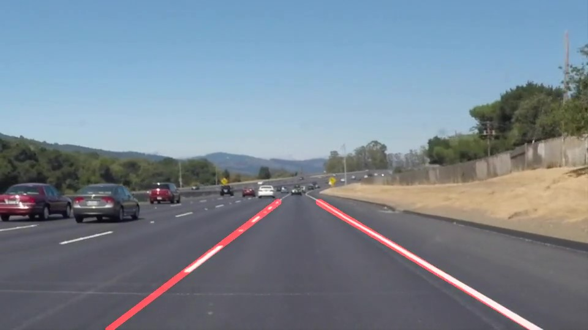
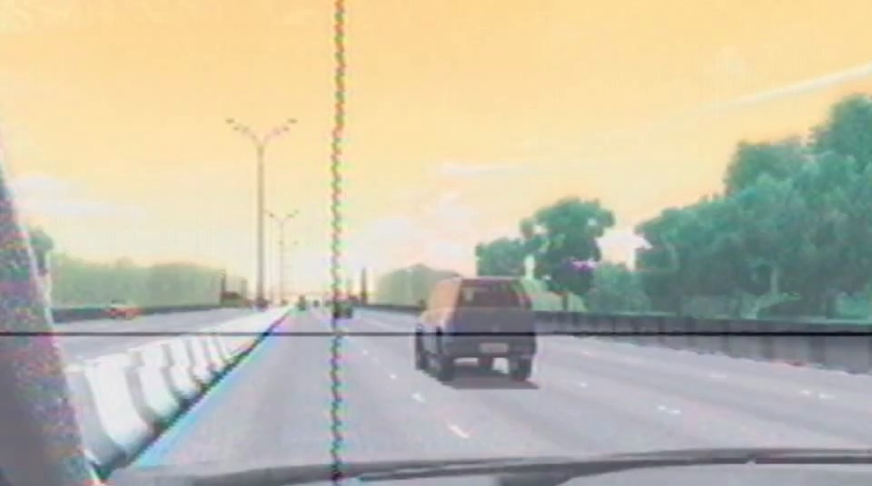
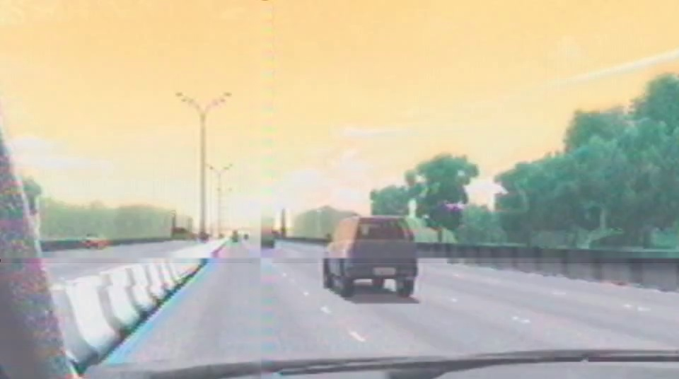

# **Finding Lane Lines on the Road** 

## Udacity Self-Driving Car Engineer Project 1
---

**Finding Lane Lines on the Road**

The goals / steps of this project are the following:

* Make a pipeline that finds lane lines on the road.
  Build a track detector with what was learned in Lesson 1 and apply it to the test images and videos.
  
* Reflect on your work in a written report.
  Suggestions are listed with future improvements.
 
---
Original Image:

Original Image with lanes:

---

### Reflection A

### 1. Pipeline of Project

* Load the image and convert it to grayscale.
* Apply Gaussian smoothing.
* Use canny edge detector to find the edges.
* Define the region of interest.
* Apply hough transformation to find the lines.
* Calculate the lines corresponding to the left and right lanes by linear regression.
* Draw the lines over the original image. 

---
<!-- blank line -->
<figure class="video_container">
  <video controls="true" allowfullscreen="true" poster="./test_videos_output/solidYellowLeft.jpg">
    <source src="./test_videos_output/solidYellowLeft.mp4" type="video/mp4">
  </video>
</figure>
<!-- blank line -->

solidYellowLeft result example:
<video src="./test_videos_output/solidYellowLeft.mp4" poster="solidYellowLeft.jpg" width="320" height="200" controls preload></video>

solidWhiteRight result example:
<video src="./test_videos_output/solidWhiteRight.mp4" poster="solidWhiteRight.jpg" width="320" height="200" controls preload></video>

Challenge result example:
<video src="./test_videos_output/challenge.mp4" poster="challenge.jpg" width="320" height="200" controls preload></video>
---

### 2. Potential Shortcomings

* Shadows and color changes on the road make it difficult to recognize the lanes.
* The use of linear regression does not recognize lines perpendicular to the x axis
* It does not work if the car changes lanes.
* It does not work if the road is not straight.
* If the lane is not very visible, recognition fails due to lack of information.
* If there is traffic, the lanes cannot be recognized.
* Rain, snow, fog and night would make it difficult to recognize the lanes.

### 3. Suggest possible improvements to your pipeline

* To identify lane changes, you need to recognize all lanes on the road.
* When you do not recognize a lane, you can use the previous recognized lane.
* Apply other filters to recognize shaded or changing color lanes.

------------------------------------------------------------------------------------

### Reflection B

### 1. Pipeline of wgb_challenge Project

* Load the image and convert it to grayscale.
* Apply Gaussian smoothing.
* Use canny edge detector to find the edges.
* Define the region of interest.
* Recognize and clear cursor (horizontal and vertical gaze lines) with hough transformation and inpaint.

---
Frame example:

Mask example:

Result example:

---

* Apply hough transformation to find the lines.
* Calculate the left lane by linear regression and estimation right lane.
* Draw the lines over the original image. 

---
wgb_challenge result example:
<video src="./test_videos_output/wgbChallenge.mp4" poster="wgbChallenge.jpg" width="320" height="200" controls preload></video>
---

### 2. Potential Deficiencies in wgb_challenge pipeline

* Low contrast, cursor over images and dashed line erased may have made it difficult to recognize the lanes.

### 3. Suggest possible improvements to wgb_challenge pipeline

* Research image processing techniques to improve contrast and color recognition.
* Study more geometric recognition methods, such as: estimation of the right line, angle correction, speed of lane change, etc. for better lanes recognition.

* Note: If possible, I would like to receive more suggestions on techniques for recognizing shapes and objects (lanes and cars) to help with my master's degree project. I need to recognize lanes and cars in 4 hours of videos like this.
