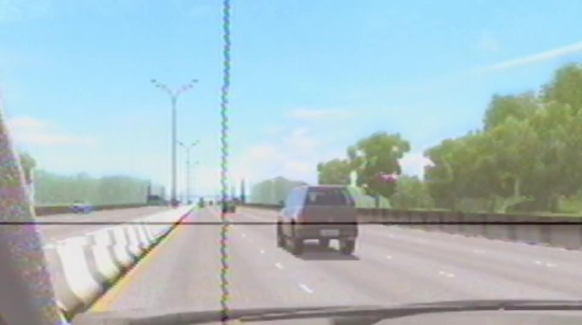
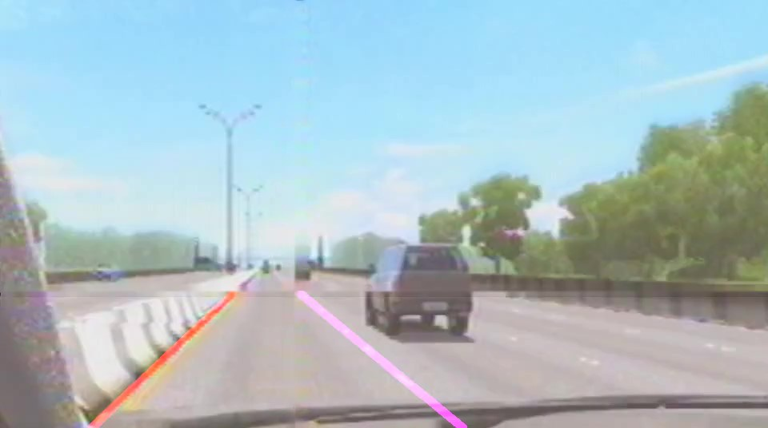
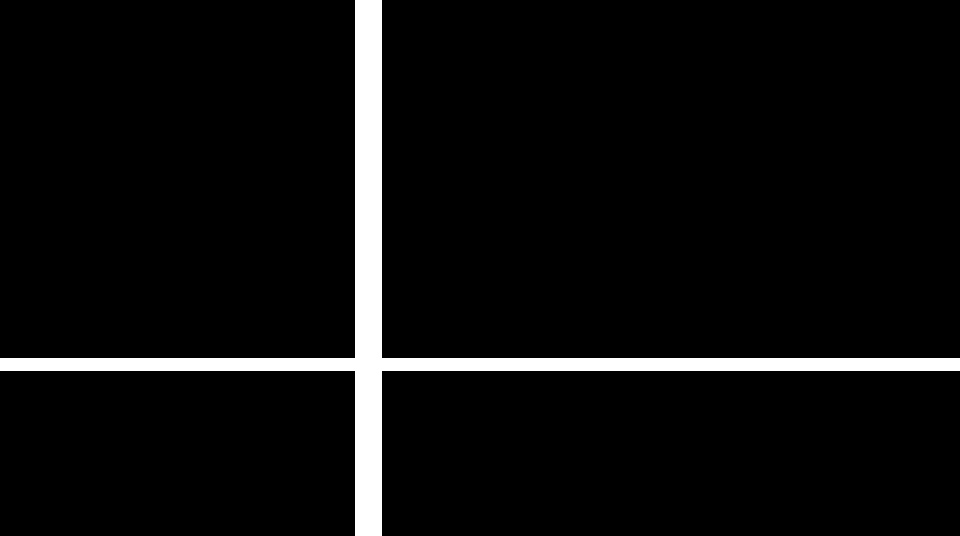

# **Finding Lane Lines on the Road** 

[//]: # (Image References)
[image1]: ./test_images/solidWhiteCurve.jpg "Original Image:"

## Udacity Self-Driving Car Engineer Project 1
---

**Finding Lane Lines on the Road**

The goals / steps of this project are the following:

* Make a pipeline that finds lane lines on the road.
  Build a track detector with what was learned in Lesson 1 and apply it to the test images and videos.
  
* Reflect on your work in a written report.
  Suggestions are listed with future improvements.
 
---
Original Image:
![alt text][image1]
Original Image with lanes:

---

### Reflection

### 1. Pipeline of Project

* Load the image and convert it to grayscale.
* Apply Gaussian smoothing.
* Use canny edge detector to find the edges.
* Define the region of interest.
* Apply hough transformation to find the lines.
* Calculate the lines corresponding to the left and right lanes by linear regression.
* Draw the lines over the original image. 

---
The result is in [test_videos_output](./test_videos_output): white_improved.mp4 and yellow_improved.mp4.

<video width="320" height="200" controls preload> 
    <source src="https://./test_videos_output/solidYellowLeft.mp4"></source> 
</video>
---

### 2. Potential Shortcomings

* Shadows and color changes on the road make it difficult to recognize the lanes.
* The use of linear regression does not recognize lines perpendicular to the x axis
* It does not work if the car changes lanes.
* It does not work if the road is not straight.
* If the lane is not very visible, recognition fails due to lack of information.
* If there is traffic, the lanes cannot be recognized.
* Rain, snow, fog and night would make it difficult to recognize the lanes.

### 3. Suggest possible improvements to your pipeline

* To identify lane changes, you need to recognize all lanes on the road.
* When you do not recognize a lane, you can use the previous recognized lane.
* Apply other filters to recognize shaded or changing color lanes.

---
**wgbChallenge Finding Lane Lines on the Road**
---

The goals / steps of this project are the following:

* Make a pipeline that finds lane lines on the road.
  wgbChallenge (wgb are my initials) is part of the master's degree to recognizing anxiety in drivers in simulators with eye tracking devices.
  This video has a cursor (horizontal and vertical lines) that represents the driver's gaze on areas of interest (lanes and cars).
  First, I need to recognize the lanes to count how often and for how long time the driver looks at them.
  
---
Original Image:

Original Image with lanes:

---

### Reflection

### 1. Pipeline of wgb_challenge Project

* Load the image and convert it to grayscale.
* Apply Gaussian smoothing.
* Use canny edge detector to find the edges.
* Define the region of interest.
* Recognize and clear cursor (horizontal and vertical gaze lines) with hough transformation and inpaint.

---
Frame example:

Mask example:

Result example:

---

* Apply hough transformation to find the lines.
* Calculate the left lane by linear regression and estimation right lane.
* Draw the lines over the original image. 

---
wgb_challenge result example:
<video src="./test_videos_output/wgbChallenge.mp4" poster="wgbChallenge.jpg" width="320" height="200" controls preload></video>
---

### 2. Potential Deficiencies in wgb_challenge pipeline

* Low contrast, cursor over images and dashed line erased may have made it difficult to recognize the lanes.

### 3. Suggest possible improvements to wgb_challenge pipeline

* Research image processing techniques to improve contrast and color recognition.
* Study more geometric recognition methods, such as: estimation of the right line, angle correction, speed of lane change, etc. for better lanes recognition.

* Note: If possible, I would like to receive more suggestions on techniques for recognizing shapes and objects (lanes and cars) to help with my master's degree project. I need to recognize lanes and cars in 4 hours of videos like this.
